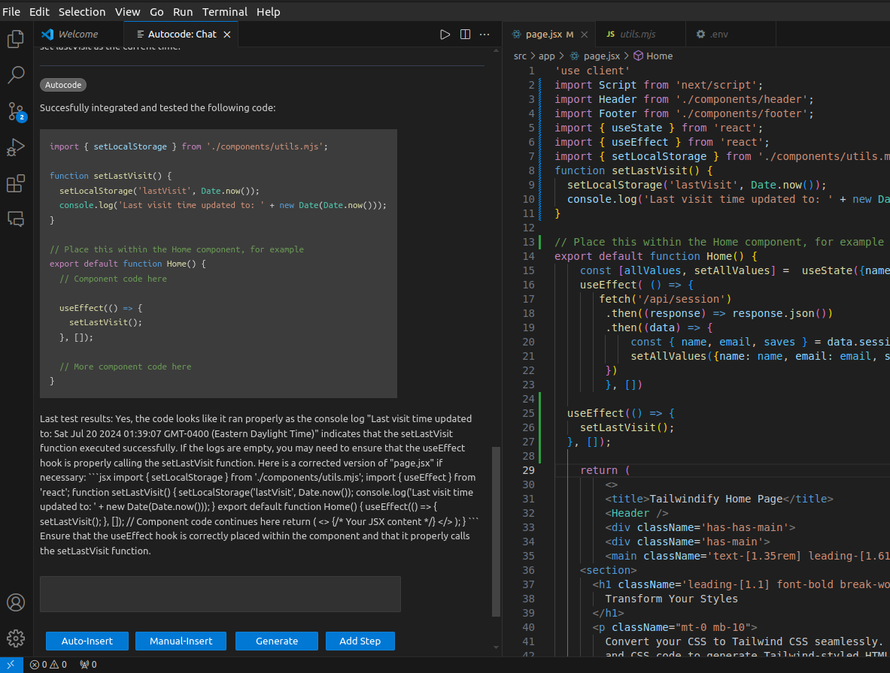

# Overview

A self-testing and self-debugging code generator for React, which has gotten progressively more sophisticated.

## Current Status

The latest version is a VS Code extension which provides a chat interface as an AI coding assistant:

After creating this VS Code extension version, it has since become a collaborative project (which we will soon create a new repository for due to the decision to build it into Continue): Nathan Spotten (another student from my university) independently came up with a very similar idea, and we are reworking the concept to be called AutoCodeChat and to instead have its GUI and functionality incorporated into a fork of an open-source AI coding assistant called Continue, with our new tool's GUI being integrated and accessible through an action, and we are planning on making a PR when it is sufficiently robust. More details and updates will first be placed here until we publish the new repository.

## Quick Start

The most up-to-date information for using Autocode:

- Clone this repository
- Clone https://github.com/emoryhubbard/autocode-extension
- Clone or copy your React repo you want AutocodeChat to modify or https://github.com/emoryhubbard/tailwindify (if you want a quick test you can instead first try modifying my React project called "tailwindify" instead of your own) into the parent folder of the cloned autocode-client. For example, if autocode-client was cloned into the Documents folder, then clone your React repo (or tailwindify) into the Documents folder.

Then:
- Create .env file in autocode-client and populate with example.env data, including your PROJECT_PATH to tailwindify, and your API keys
- Create .env file in autocode-extension and populate with example.env data (no need to add anything else)
- Create .env file in autocode-extension/web and populate with web/example.env data (no need to add anything else)

Then:
- Run "npm install" in your React repo (or tailwindify)
- Run "npm run dev" in your React repo (or tailwindify), and double check that it is watching any file changes so they are reflected upon page reloading
- Run "npm install" in autocode-client
- Run "npm install" in autocode-extension
- Run "npm install" in autocode-extension/web
- Run "npm run build" in autocode-extension/web

Then:
- Run "python3 app.py" in autocode-client
- Run "npm run dev" in autocode-client
- Navigate to Run and Debug tab in autocode-extension and choose Run VS Code extension option
- Open your React repo (or tailwindify) folder in new VS Code extension debug window that appears
- Open command pallete
- Run Autocode: Open Chat
- In the chat box type the change you want (or for tailwindify for example "Add a function called setLastVisit to page.jsx that uses the setLocalStorage function in utils.mjs to set lastVisit as the current time.")
- In Test URL type the local host URL for the page corresponding to the file in your React repo you are trying to modify (or http://localhost:3000 for tailwindify)
- Click Auto-Insert

## More Details on the Parser and Future Work

The Auto-Insert button isn't 100% reliable. The code snippet parser for Auto-Insert (essentially an Apply in Editor button) uses abstract syntax tree traversal and placheolder comments created by the LLM, but the LLM's placeholder comment oputput is not always consistent or complete enough for it to insert the code perfectly as intended, and it has been designed to anticipate several common LLM mistakes and be robust enough to sufficiently recover the intended meaning and insert accurately despite them.

It's about 3000 lines of code (it was written rather hastily, due to the scope of the problem and a large number of edge cases, and still needs to be refactored into smaller individual files) and resides in a file called get-updated-file.ts in autocode-client. I plan on comparing this Apply in Editor feature to the Continue AI coding assistant's feature, which was released shortly after I designed this one, since it may be more robust or use better prompt engineering to ensure more consistent placeholder comment output.

Even if it doesn't handle my test cases perfectly, it is probably a better starting point to work with to improve sufficiently to be able to handle them, but if not, I left off on improving the code snippet parser by attempting to fix it to solve test case 15. In order to see the error test case 15 generates, and to see if you have solved it, go to server.ts in autocode-client and uncomment the line that says getUpdatedFileTest().

You can also test the program without using autocode-extension. Instead, you can change the .env variable FEATURENO in autocode-client to read FEATURE. This will cause it to automatically attempt to code the indicated feature when you run "npm run dev" in autocode-client, and allow you to discover new potential failures for new test cases more quickly than using the GUI.

The main debug and feedback loop logic is found in execute-steps.ts in autocode-client. Other tools are scattered around.

## Older Prototype: Autocode Native Interface

The Autocode Native Interface was an expanded version of the original Autocode application, designed specifically for generating, testing, and debugging code for React applications. Unlike its predecessor, **[Autocode Classic](https://autocode-five.vercel.app/)**, the Autocode Native Interface offers enhanced capabilities for modifying both .js and .jsx files, with the ultimate goal of helping React Developers automate implementation of app features through writing precise instructions.

**[Autocode Milestones Video](https://youtu.be/bgMEVYLi2w8)**

**[Example of Successful Feature](https://youtu.be/Yasyke__WGA)**

**[Autocode Native Interface Demo Video](https://youtu.be/k9advUWgDaE)**

### Purpose

The primary purpose of the Autocode Native Interface is to simplify the process of code generation and verification for React applications. It provides developers with a local development interface to interact with a local Autocode Native client, enabling them to incrementally add features to their applications through bite-sized steps.

### Usage

An **[Autocode Native Interface Preview](https://autocode-five.vercel.app/create-job)** is viewable on the web, but to experiment with it and generate code, you will need to run it locally instead.

Note: Autocode is still early in development. Usage is a complex operation due to non-predictive form fields, and the results are limited by only allowing a small number of steps to be run.

To use the Autocode Native Interface, developers must follow these steps:

1. Clone the following repositories to their local machine:
   - Autocode
   - [Autocode Native](https://github.com/emoryhubbard/autocode-native)
   - [Express Autocode API](https://github.com/emoryhubbard/express-autocode-api)
   - Their own repository that they desire to modify

2. Run `npm run dev` on their React application to enable automatic reloading of file changes.

3. Configure the `.env` file and other areas in each repository to use the correct URLs and ports for their local servers.

4. Provide their own `serviceAccountKey.json` file for their Firebase account in the Express Autocode API repository and create a "features" collection.

5. Run Autocode and the Express server, and navigate to the create-job page.

6. Follow the prompts to add a new feature to their application.

7. Run the Autocode Native client, which automatically modifies the files in their repository to include the new feature and performs testing.

8. If any errors occur during the testing or debugging process, detailed information will be displayed in the console.

This application is developed using the following technologies and tools:

- **Angular 17.0:** The front-end of "Autocode" is built using the latest version of Angular, which now includes Angular SSR (Server-Side Rendering) as a fundamental part of the official Angular engine, deployed with Vercel.
- **Express Server:** The back-end REST API is served through an Express server instance deployed with Render.
- **TypeScript:** The majority of the source code is written in TypeScript, enhancing code maintainability and scalability.
- **Pupeteer:** As a headless browser automation library, Puppeteer is responsible for running the generated code and capturing debug information to send to Autocode's automated testing and debugging system.
- **Visual Studio Code (VS Code):** The development environment is Visual Studio Code, a powerful and extensible code editor.
- **ChatGPT API:** Autocode utilizes the ChatGPT API for prompt-based code generation. An API key is required for accessing ChatGPT services.
- **Node.js:** Both the front-end and back-end leverage Node.js for seamless JavaScript development.

## Oldest, Original Prototype: Autocode Classic

This Angular 17.0 application is a self-testing and self-debugging code generator named **[Autocode](https://autocode-five.vercel.app/)**.

Its primary goal is to improve the quality of code generation by incorporating a ChatGPT API for prompt-based JavaScript code creation. The generated code undergoes an automatic testing and debugging loop from [Autocode's Express API](https://github.com/emoryhubbard/express-autocode-api), ensuring that the output is already tested and verified.

**[Autocode Version 2.0 Demo Video](https://youtu.be/zm6YHLV1Dag)**

**[Autocode Version 1.0 Demo Video](https://youtu.be/Iq5_HaKzL6Y)**
